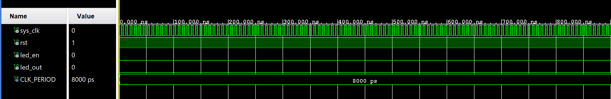
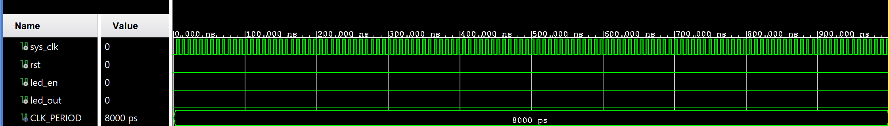
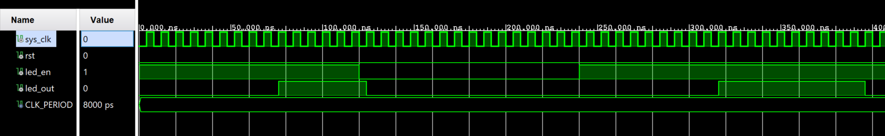
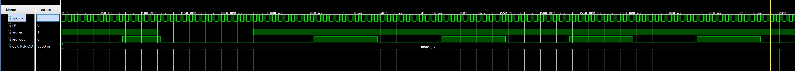

# Overview
This project uses the Zybo Z7 board. A blinking LED is implemented which toggles every 0.5 seconds. The enable switch (sw0) set to logic high will allow the counter to run and LED 0 (ld0) will be toggled when the counter reaches a threshold. The reset button will set LED 0 (ld0) to logic low and will set the counter to 0.
# Design Summary
The clock frequency on the Zybo Z7 is 125 MHz. Our goal is to toggle the LED every 0.5 seconds. Using a 62,499,999 toggle threshold, the board's LED can be toggled every 0.5 seconds. One complete ON/OFF cycle takes one second. This design is using sequential and combinational logic. Combinational logic is used to continuously drive led_out with the led_internal signal. If sequential logic is used for that assignment, the desired led_out signal will be delayed by at least one clock cycle. The rest of the circuit is sequential since the rising edge of the clock is utilized to increment the counter and update the logic.
# Verification and Results

The VHDL code was tested with a testbench by lowering CLK_CYCLES_PER_TOGGLE from 62,500,000 (0.5 s) to 10 (80 ns). led_out is connected to the Zybo Z7's ld0. When rst = '1', the counter is reset to 0 and the LED is set to logic low. When led_en = '1', the counter is incremented by 1 on every rising clock edge. The following tests show that the current LED blinker implementation meets all of the following specifications:

When rst = '1', counter is reset to 0 and the LED is set to logic low. 

when led_en = '1', led_out will toggle every 10 clock cycles.

When led_en = '0', the counter does not increment, resets to 0, and led_out does not toggle.

<h4><strong>Test Case 0 - Reset Asserted</strong></h4>

<h4><strong>Test Case 1 - Reset or LED enable not toggled</strong></h4>

<h4><strong>Test Case 2 - LED output is logic low when led enable is logic low</strong></h4>

<h4><strong>Test Case 2 - Near complete view</strong></h4>

# Known Issues or Limitations
N/A
# References
[Zybo Z7 reference manual](https://digilent.com/reference/programmable-logic/zybo-z7/reference-manual)