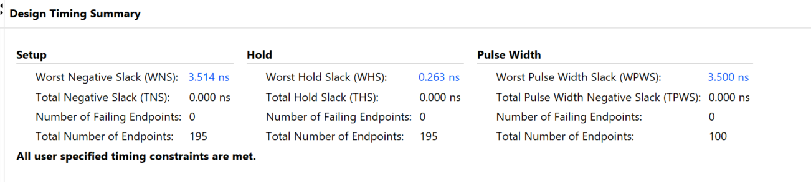
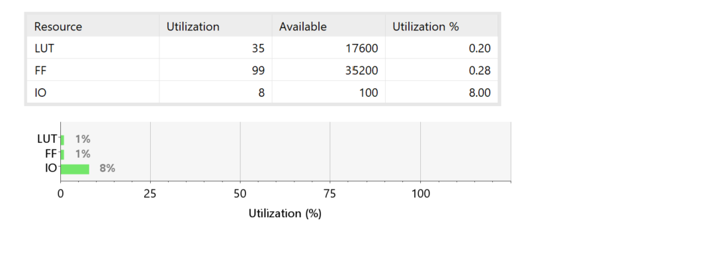
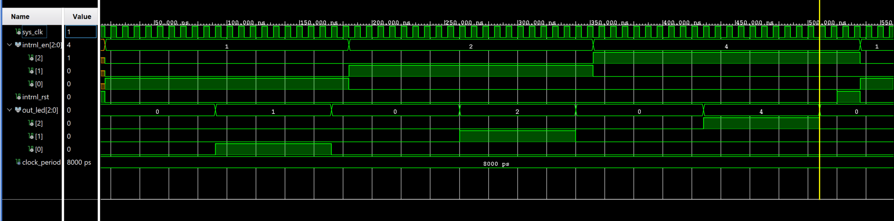
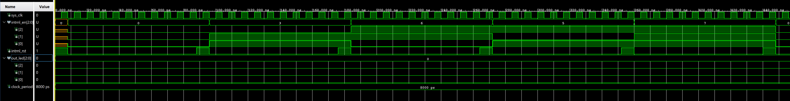
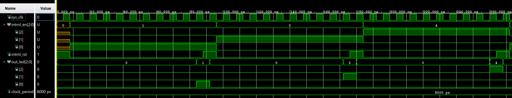
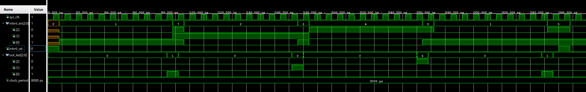
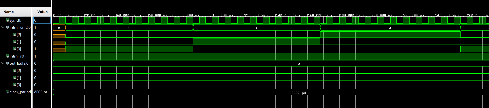
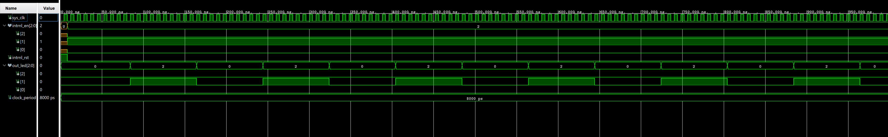
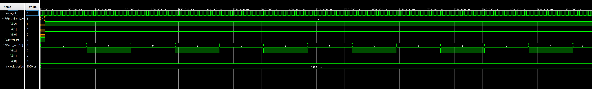

# Overview
This project was tested on the Zybo Z7 Board. The project implements mutually exclusive blinking RGB channels. The selected RGB channel will toggle every 0.5 seconds. 3 on board switches enable the mutually exclusive RGB channels on a blinking LED. 1 normally open push button activates a reset when pressed.  sw0 enables red light on LED6. sw1 enables green light on LED6. sw2 enables blue light on LED6. btn0 triggers a reset. A single switch which is set to logic high will allow the corresponding counter to run and the associated LED6 channel will be toggled when the corresponding counter reaches a threshold. A triggered normally open reset button will turn off all LED channels and set the counters to 0.
# Design Summary
The Zybo Z7's programmable logic clock frequency is 125 MHz. A blinking LED that toggles every 0.5 seconds is achievable by setting the counters' threshold to 62,500,000. A complete ON/OFF cycle takes one second. The project's design uses combinational and sequential logic. Entity Instantiation is applied alongside combinational internal logic. The combinational logic determines whether exactly one enable switch is at logic high and, if so, enables the corresponding blinking circuit. The entity instantiations are controlled with 3 internal logic signals. 1 internal logic signal for red, 1 internal logic signal for blue, and 1 internal logic signal for green. One entity instantiation for each color. 1 internal logic signal connects to an entity's LED enable input. The sequential logic increments each enabled counter on every rising edge of the system clock.

# Verification and Results

<h4><strong>Design Timing Summary</strong></h4>

All timing constraints are met.

<h4><strong>Resource Utilization Report</strong></h4>

FPGA has required resources to run project.

<h4><strong>Test Case 0 - all LED channels working</strong></h4>

All 3 led channels are toggled when the allotted clock cycles are reached. The assigned clock cycles are determined by CLK_CYCLES_PER_TOGGLE. In this case, CLK_CYCLES_PER_TOGGLE is set to 10. The corresponding channel is toggled when 10 clock cycles are reached.

<h4><strong>Test Case 1 - LED channels off</strong></h4>

The LED channels cannot be toggled when zero, two, or three enable switches are set to logic high.

<h4><strong>Test Case 2 - LED channel on to off</strong></h4>

A reset signal set to logic high will set all rgb channels to logic low.

<h4><strong>Test Case 3 - LED channels on to off based on switches</strong></h4>

Two or more enable switches set to logic high will set all rgb channels to logic low.

<h4><strong>Test Case 4 -LED channels low and reset high</strong></h4>

The LED's RGB channels can't be set to logic high when reset is set to logic high.

<h4><strong>Test Case 5 - red LED channel</strong></h4>

The red blinking circuit is enabled when reset is deasserted (rst = '0'), SW0 = '1', and both SW1 and SW2 are '0'.

<h4><strong>Test Case 6 - green LED channel</strong></h4>

The green blinking circuit is enabled when reset is deasserted (rst = '0'), SW1 = '1', and both SW0 and SW2 are '0'.

<h4><strong>Test Case 7 - blue LED channel</strong></h4>

The blue blinking circuit is enabled when reset is deasserted (rst = '0'), SW2 = '1', and both SW0 and SW1 are '0'.

# Known Issues and Limitations
N/A
# References
[Zybo Z7 Reference Manual]("https://digilent.com/reference/programmable-logic/zybo-z7/reference-manual")